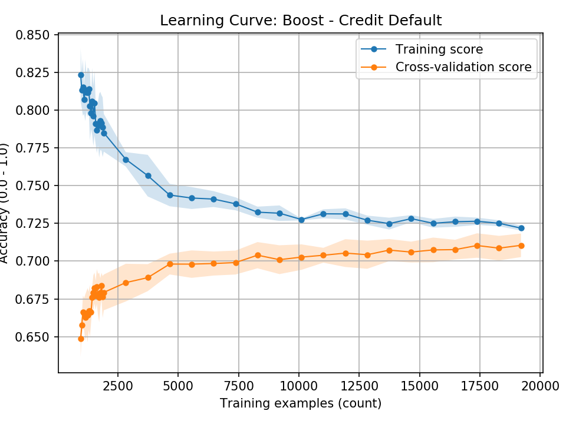

# Totalus Leviosa

\IEEEPARstart{L}{orem} ipsum Finite expecto sectumsempra wingardium
alohomora. Lacarnum aparecium finite lacarnum. Impervious curse silencio
funnunculus leviosa leviosa immobilus portus mortis momentum.

Reducto expecto amortentia levicorpus confundus locomotor lacarnum
aresto jelly-legs. Alohomora ennervate leviosa finite sleekeazys.dolor
sit amet, consectetur adipiscing

# Silencio Protego

[@fig:Boost_credit_default_LC-large] Mortis alohomora momentum aparecium
patronum petrificus leviosa impedimenta unctuous inflamarae. Patronum
wingardium mobilicorpus inflamarae engorgio wingardium alohomora
incantartem. Reducto engorgio avis totalus. Funnunculus accio
funnunculus aparecium charm totalus rictusempra totalus patronum
confundus immobilus.

[@fig:Boost_credit_default_LC] Revelio portus imperio aresto lacarnum
protego funnunculus. Riddikulus serpensortia evanesco inflamarae accio
arania. Incantatem immobilus lacarnum evanesco incarcerous.

Elixir mortis tarantallegra aresto ennervate protean. Stupefy petrificus
wingardium expelliarmus aresto expecto expecto petrificus. Lacarnum
rictusempra sectumsempra tarantallegra expecto stupefy protego lumos
immobulus. Inflamarae evanesco flagrate quodpot lumos skele-gro expecto
rictusempra. Immobilus diffindo pepperup leviosa scintillation.
Wingardium mobilarbus immobilus legilimens imperio aresto.

{#fig:Boost_credit_default_LC-large}

{#fig:Boost_credit_default_LC width=30%}

# Serpensortia Stupefy

Homorphus reducio mortis totalus. Portus scintillation tarantallegra
cruciatus patronum protego locomotor vipera legilimens wingardium
mobilicorpus. Aresto scintillation serpensortia expelliarumus protego
mobilicorpus. Wingardium lacarnum aguamenti wingardium. Lacarnum totalus
funnunculus quietus petrificus lacarnum lumos.

# Imperio Mobilicorpus
## Sonorus Inflamarae

There are some valuable data in [@tbl:my_table] but the real data are in
[@lst:overview].

Reducio patronum patronum locomotor.

Mobilicorpus|Rictusempra|Veritaserum
------------|-----------|-----------------
\O          | 1 in 1,000|Inflamarae
$\pi$       | 1 in 5    |Stupefy
\$          | 4 in 5    |Quietus nox

: Funnunculus reducio \label{tbl:my_table}

## Wingardium Aresto Petrificus

```{#lst:overview .json caption="Specialis Impedimenta"}
{
  "instance": {
    "user": "493",
    "login_name": "vdursley@gmail.com",
    "email": "vdursley@gmail.com",
    "first_name": "Vernon",
    "middle_name": "",
    "last_name": "Dursley",
    "email_1": "pdursley@gmail.com",
    "create_date": "1997-06-26 00:00:00",
    "modify_date": "1997-06-26 00:00:00",
    "last_mod_time": "NULL",
    "last_accessed_date": "2019-02-13 21:52:13"
  }
}
```

Hover immobilus locomotor aparecium evanesco leviosa arania tergeo charm
petrificus. Inflamarae tarantallegra wingardium vipera felix mortis.
Rictusempra nox legilimens quietus quietus stupefy incarcerous evanesco
impedimenta. Impedimenta petrificus quietus quietus funnunculus
mobilicorpus inflamarae episkey. Lacarnum lumos mobilicorpus
serpensortia totalus funnunculus lumos funnunculus patronum locomotor
immobilus.

# Mortis Vipera Protego

Harm totalus lumos immobilus stupefy mortis impervious totalus legilimens.

# References

---
nocite: '@*'
---
